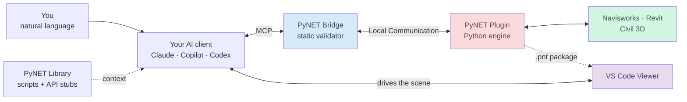

<p align="center">
  
</p>

<p align="center">
  <a href="https://raendt.com">raendt.com</a> &middot;
  <a href="mailto:info@raendt.com">info@raendt.com</a> &middot;
  Madrid, Spain
</p>

---

## Who we are

**RAEN Digital Tools** is a software company specialised in automation and artificial intelligence
for BIM environments. We come from digital engineering, not from generic software — the tooling
here was built while coordinating real projects, and it shows in what it chooses to solve.

We work three ways: as a **product** you install, as an **engine** partners extend, and as an
**implementation project** we run alongside your team.

| | |
| :--- | :--- |
| 🧭 **Specialised team** | Digital engineering and software development working together, continuously. |
| 🛠️ **Our own technology** | Tooling standardised over years of real BIM coordination, not adapted from elsewhere. |
| 📈 **Scalable by design** | Solutions built to grow with your organisation, at any project size. |
| 🤝 **Continuous support** | We stay from design through deployment and into the evolution of the solution. |

---

## What we do

| | |
| :--- | :--- |
| **BIM automation** | Repetitive coordination, auditing and reporting work, automated inside the Autodesk tools your team already uses. |
| **AI integration** | Connect your AI assistant to live models so it can query, analyse and modify them — not just talk about them. |
| **Custom development** | Workflows encoding your own engineering criteria: tolerance rules, BEP standards, budget structures. |
| **Deployment & training** | Company-wide rollout, with the people side handled as seriously as the technical one. |

---

## PyNET Platform — our product

Our platform lets an AI assistant operate **Autodesk Navisworks, Revit and Civil 3D** directly.
You describe a task in your own words; the assistant writes the Python, it runs **inside the live
model**, and when the Autodesk API rejects something the error comes back and the script gets
rewritten.

> It executes, reads the result, and acts on it — inside the process, on your machine.
> Nothing is handed to you to paste.



Every arrow above stays on your machine — the bridge, the plugin and the viewer all communicate
locally. The only thing that ever leaves is the conversation you have with the AI provider you
chose.

<p align="center">
  <a href="https://github.com/RAEN-DT/PyNet/releases"></a>
  <a href="https://pypi.org/project/pynet-mcp-bridge/"></a>
  
  
  
  
</p>

---

## The repositories

| | Repository | What it is |
| :--- | :--- | :--- |
| ⚙️ | **[PyNet](https://github.com/RAEN-DT/PyNet)** | The plugin. Hosts the embedded Python.NET engine inside Navisworks, Revit and Civil 3D, plus the ribbon/UI layer the AI can extend at runtime. |
| 🛡️ | **[PyNetBridge](https://github.com/RAEN-DT/PyNetBridge)** | The MCP server. Exposes the platform to any MCP-compatible AI client and statically validates every script *before* it reaches Autodesk. On PyPI as `pynet-mcp-bridge`. |
| 📚 | **[PyNetLibrary](https://github.com/RAEN-DT/PyNetLibrary)** | The AI's knowledge base — **125+ production-tested reference scripts**, **189 stub modules** mirroring the Autodesk .NET APIs, and the workflow skills below. |
| 🧊 | **[PyNetVSCode](https://github.com/RAEN-DT/PyNetVSCode)** | VS Code extension: embedded 3D BIM viewer + one-click setup of the bridge across every AI client you have installed. |

---

## Engineering criteria, not just code

The workflows we ship encode the judgement an experienced coordinator applies, so the assistant
runs a whole process rather than a single command. This is where the digital-engineering side of
the company shows up in the software.

| Workflow | Host | What it does |
| :--- | :--- | :--- |
| **ClashDetection** | Navisworks | Builds the clash matrix from dynamic SearchSets, runs the tests, and auto-triages results against tolerance rules. |
| **ClashCoordination** | Navisworks → Revit | Reads reviewed clashes and generates the corresponding sleeves and floor openings in Revit — across two hosts, in one conversation. |
| **ClashToleranceComparison** | Navisworks | Re-runs the full matrix under different tolerances and produces a side-by-side Excel comparison. |
| **QCModelAudit** | Revit | Audits a model against BEP standards and issues a scored HTML + Excel report. |
| **QuantityTakeoff** | Revit | 5D extraction: matches model quantities to a reference budget and builds the measurement breakdown. |
| **WindSiting** | Civil 3D + GIS | Wind-farm siting for any zone in Spain — terrain, wind resource, exclusions and a suitability heat map as native Civil 3D objects. |
| **PowerlineFireRisk** | Civil 3D + GIS | Wildfire exposure of a transmission line from Sentinel-2 imagery, ranked by segment, draped on the terrain. |

---

## What it looks like in practice

In [this recorded session](https://www.youtube.com/watch?v=Vw7ig8TItng), an AI client connects to
**Revit and Navisworks at the same time** and runs a coordination cycle end to end:

1. **Audits** both models and flags the elements missing their classification parameter.
2. **Runs the clash matrix** and applies the tolerance rules to decide what to auto-approve.
3. **Generates the sleeves** in Revit — real geometry, rotated to match each pipe's angle.
4. **Hits a live Revit API type exception**, reads the stack trace, rewrites the script, and finishes.

Step 4 is the point. Everything before it, other tools do.

**More:** [AI coordination in Navisworks](https://www.youtube.com/watch?v=Sfq9iXJFacU) ·
[Setup with Codex](https://youtu.be/HdmbCO_pTN0) ·
[Configuring the plugin](https://www.youtube.com/watch?v=3eR5GAOkEug)

---

## Start here

> **Requirements:** Windows · Python **3.10 or higher** (3.14 supported) · the Autodesk host you
> want to drive.

**The one-step route** — the [VS Code extension](https://github.com/RAEN-DT/PyNetVSCode) installs
the bridge, configures every AI client it finds, and gives you the BIM viewer:

```
Extensions → search "PyNet Platform" → Install
```

**Bridge only:**

```powershell
pip install pynet-mcp-bridge
```

Detected and configured automatically: **Claude Desktop**, **Claude Code**, **GitHub Copilot**,
**Codex**, **Cline** and **Roo Code**. Full instructions live in
[PyNetBridge](https://github.com/RAEN-DT/PyNetBridge).

> **Bring your own AI.** PyNET is the integration layer, not a model vendor. No AI subscription is
> included — you connect the client and provider you already use.

---

## The viewer is free

<p align="center">
  
</p>

Export a `.pnt` package — a single self-contained file with the federated models and the clash
data — and open it in VS Code. Spatial tree, properties, sections, measurements, clash results.

The interesting part: your AI drives the same scene while it talks. It isolates the discipline it
is discussing, highlights both sides of a clash in red and green, and points at the element it just
measured. **No licence required to open and explore a package.**

---

## Licensing

| Tier | For |
| :--- | :--- |
| **Viewer** | Free, forever. Open and explore any `.pnt` package. |
| **Trial** | 30 days of full platform access — request at [info@raendt.com](mailto:info@raendt.com). |
| **Basic** | One Autodesk host. |
| **Pro** | All hosts, simultaneously. |
| **Enterprise** | Company-wide deployment with an implementation project. |

---

## Security by design

The sandbox is **closed on purpose**, and we do not widen it for convenience.

* **Static validation** — every AI-generated script is parsed and checked against an import and
  call whitelist. Rejected scripts never leave the MCP server.
* **No network from the sandbox** — `os`, `subprocess`, `socket`, `urllib` and friends are blocked
  at the root. Code that legitimately needs them runs through its own launcher, outside the bridge.
* **Local execution only** — scripts run in-process, on your machine, on your models.
* **No telemetry** — no collection, no analytics, nothing sent to us or to any third party.
* **Human-executed, human-responsibility** — scripts you save to a ribbon button are yours to run;
  only the AI path is sandboxed.

Full policy: **https://privacy.raendt.com/**

---

## Work with us

| | |
| :--- | :--- |
| 💼 **Projects & deployment** | [info@raendt.com](mailto:info@raendt.com) |
| 🌐 **Website** | [raendt.com](https://raendt.com) |
| 🐛 **Bugs** | Open an issue in the relevant repository. |
| ❓ **Questions** | [PyNET FAQs](https://github.com/RAEN-DT/PyNet/wiki/PyNET-FAQs) |
| 🖥️ **Platform** | Windows only — the Autodesk hosts and the local communication layer are Windows-bound. |

---

<sub>PyNET Platform is intended for professional use in BIM automation. Users are responsible for
reviewing and validating AI-generated scripts before applying them in production.</sub>

<p align="center">
  <br/>
  <br/>
  <sub>© 2026 RAEN Digital Tools · Todos los derechos reservados.<br/>
  Obra inscrita en el Registro de la Propiedad Intelectual de la Comunidad de Madrid.</sub>
</p>
